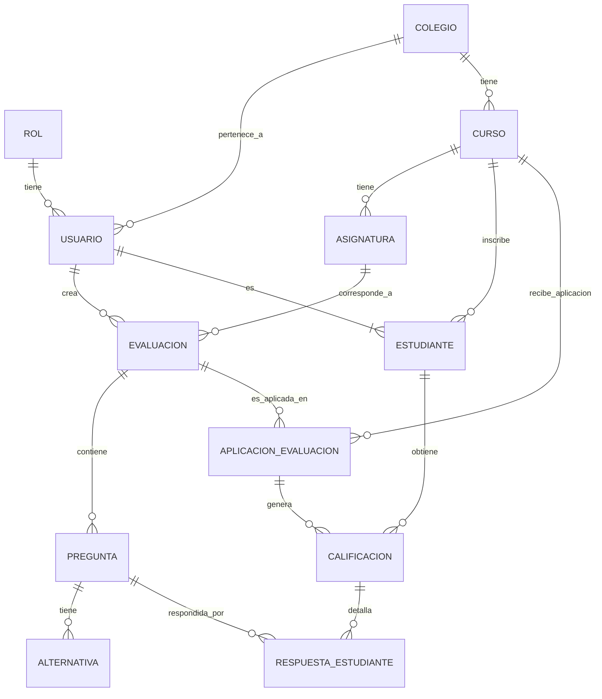

# EduMetrics

## Resumen del Proyecto

EduMetrics es un sistema web MVP orientado a colegios, que permite la gestión y aplicación de pruebas online para estudiantes.  
El sistema soporta distintos roles de usuario (estudiante, profesor, UTP, administrador y superadmin), cada uno con funcionalidades específicas.  
Los profesores pueden crear evaluaciones con preguntas de desarrollo o alternativas, asignarlas a cursos y asignaturas, y definir parámetros de aprobación.  
Los estudiantes pueden rendir pruebas y, según configuración, ver sus calificaciones.  
El sistema también permite la gestión de colegios, cursos, asignaturas y métricas de desempeño académico.

## Características Principales
- **Roles de Usuario**: Estudiante, Profesor, UTP, Administrador y Superadmin.
- **Gestión de Evaluaciones**: Creación de evaluaciones con preguntas de desarrollo o alternativas.
- **Aplicación de Evaluaciones**: Los estudiantes pueden rendir pruebas asignadas a sus cursos.
- **Calificaciones**: Generación de calificaciones basadas en las respuestas de los estudiantes.
- **Métricas**: Visualización de métricas de desempeño académico por curso, asignatura y estudiante.
- **Gestión de Instituciones**: Permite a los superadmins gestionar colegios y sus usuarios.

## Tecnologías Utilizadas
- **Backend**: Node.js, Express, MongoDB
- **Frontend**: React, Redux, Material-UI
- **Autenticación**: JWT (JSON Web Tokens)
- **Testing**: Jest, Supertest
- **ORM**: Mongoose para MongoDB
- **Documentación**: Swagger para la API
- **Diagramas**: Mermaid para diagramas ER

## Diagrama ER



## Instalación

```bash
npm install
```

## Uso

```bash
npm start
```

## Estructura

- `src/` Código fuente
- `.env` Variables de entorno (no subir a git)